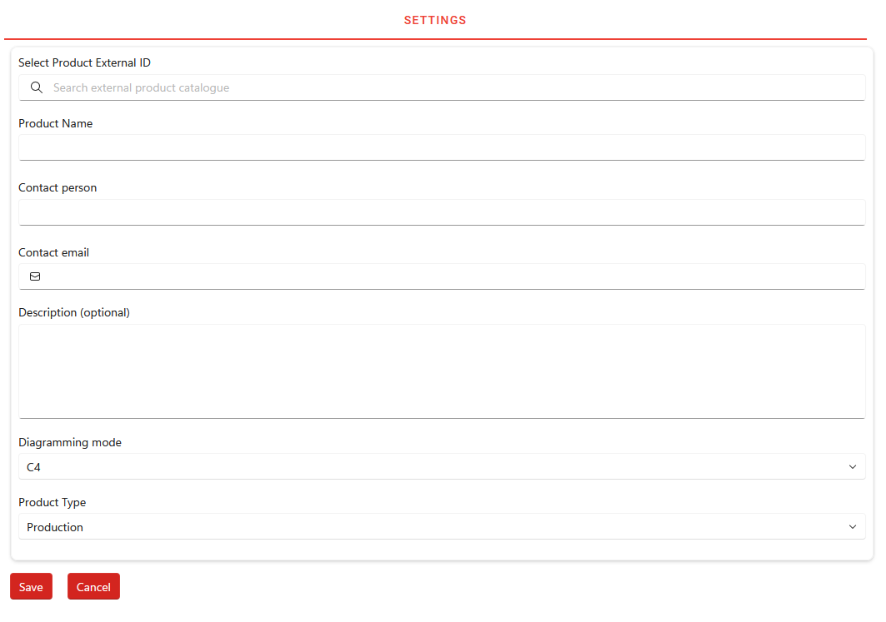
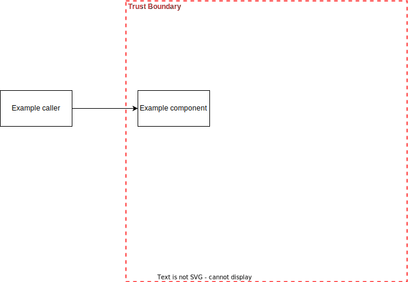
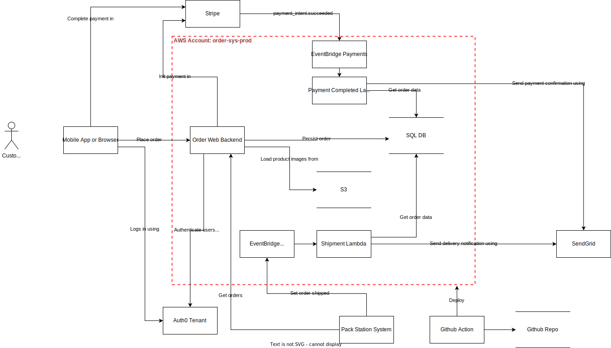
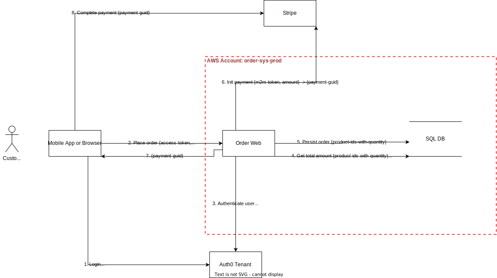
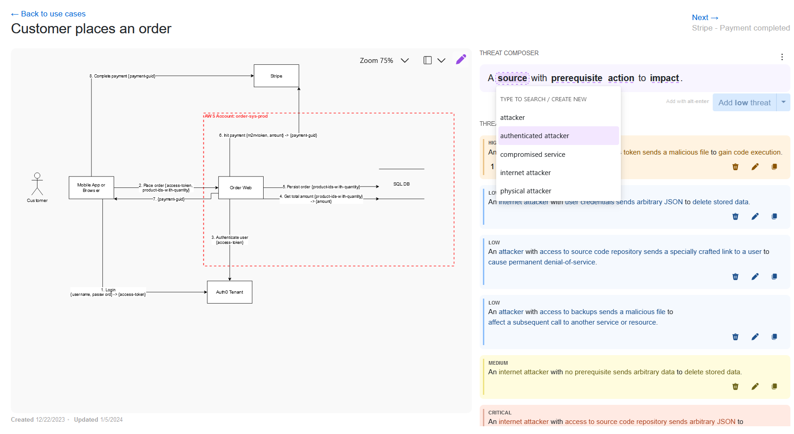
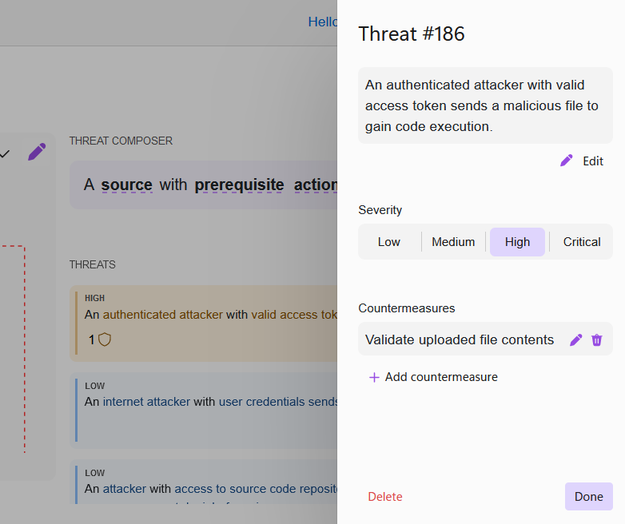

# Threat modeling with Oplane #
In this guide you'll learn how to:
1. Systematically describe "What are we working on?"
   - Add a new product to Oplane
   - The threat scope (system overview) diagram
   - Use cases
   - Use case diagrams
1. Identify "What can go wrong?"
   - Add _context-specific threats_ using the threat composer
   - Add threats from _threat library_
1. Document "What are we going to do about it?"
   - Add _Countermeasures_
   - Sync with JIRA to create implementation tickets
1. Review a threat model - "Did we do a good enough job?"
> [!NOTE]
> All of the above can be mapped to the [four key questions of threat modeling](https://www.threatmodelingmanifesto.org/), which we'll explain more about later:
> 1. What are we working on?
> 1. What can go wrong?
> 1. What are we going to do about it?
> 1. Did we do a good enough job?
## Add a new product ##
Before you can start threat modeling your product/application, you need to add it to Oplane. This is something you only need to do once per product/application.

Follow these steps to create a new product in Oplane:
1. Under Products, select <kbd>ADD PRODUCT</kbd>
1. Search and set a Product External ID (Enterprise-only feature) that uniquely identifies your product or system
1. Fill in the required fields _Product name_, _Contact person_ and _Contact email_.
1. Set your preferred Diagramming mode. In this guide we'll use _Data Flow Diagrams_.
1. Set your Product Type. If you are uncertain, choose _Production_. _Experimental_ is reserved for training and experimental purpose. _Utility_ is suitable for software that is not a standalone Product.
1. Create your product by pressing <kbd>Save</kbd>

> [!TIP]
> Product External ID is optional if you set Product Type: _Experimental_ or _Utility_.
> All fields can be modified later under the Settings tab of a product.
## The threat scope diagram  (system overview) ##
The first key step in threat modeling is to describe _What are we working on?_. This is crucial for all participants in threat modeling (including reviewers)
to gain a mutual understanding of the scope. A good place to start, is to create an "overview" diagram - the threat scope. Your product will have a placeholder diagram by default, if you've selected _Data Flow Diagrams_ as diagramming mode.

### What to include, and some drawing conventions ###
We recommend that a threat scope diagram includes all components (web services, serverless apps, databases, external dependencies, browser, mobile app etc), and the relationships between them. Components can be illustrated as rectangles (boxes) - while data sources (buckets, databases, file systems etc) are usually illustrated as two parallel horizontal lines.
### Trust boundaries ###
Use Trust Boundaries (red dotted lines in the example) to illustrate grouping of components that are administered together.
In **public cloud applications**, there's typically at least one Trust Boundary - the cloud account/project, wherein the IAM rights affecting your deployment are administered. Only include the trust boundaries that you control. If your dependencies are in a separate cloud account, just illustrate them as components outside your own trust boundary.
In **on-premise deployments**, a Trust Boundary typically represents a segmented internal network where your application is deployed. In such scenarios, try to illustrate how your application is exposed to the public internet (or other networks as applicable).
In **IoT products**, there's typically a Trust Boundary representing the physical product where your software is deployed. If you are threat modeling an IoT application, it might interact with other applications within the same IoT product - and with cloud-based backend applications.
> [!NOTE]
> One of the key purposes with Trust boundaries, is for someone viewing the diagram to easily understand where the data flow crosses the boundary of trust - both incoming and outgoing. Such crossing of trust boundaries typically means that there's a potential threat. If a web client on the internet can call your application, so can a threat actor. If your application makes calls to another system (outside your trust boundary),  a threat actor might try affect such calls - or steal the M2M credentials used in such communications. Make sure your diagram is easy to understand - it supports the discussion later, as you identify threats and countermeasures.
### Relationships ###
We recommend that arrows illustrating a relationship, point from the component (that is dependent on something) towards its dependency. E.g. a web service that has a dependency to a database will have an arrow pointing to the database. Feel free to add a descriptive text on the arrow, but keep it short to ensure that the diagram doesn't become cluttered with text.
### CI/CD pipeline ###
If your application is built and deployed using CI/CD, include your main pipeline components in the Threat scope diagram. It's important to consider what the CI/CD integration means when identifying threats and countermeasures later.

## Use cases ##
We've already explained the importance of describing _What are we working on?_, and how the threat scope diagram provides an overview of the system. But a single diagram can easily become cluttered and difficult to read, if it's supposed to illustrate the data flow of all use cases.
To provide more detail in _What are we working on?_, we recommend that you list the main use cases of your application - and that you create use case diagrams for each of them.
## Use case diagrams ##
The use case diagrams are very similar to the threat scope diagrams, with a few notable differences:
1. Relationships are numbered, to illustrate the order in the data flow (see syntax example below)
1. Relationships have a descriptive text to illustrate the call being made, and what key parameters that are sent (see syntax example below), and key return value(s)
1. Only components relevant to the use case are included
The easiest way create a new use case diagram is to clone the threat scope diagram and adjust based on the above.

Use case diagram for "Customer places an order":

> [!TIP]
> *Syntax examples for relationships in UC diagrams:*
> * Example 1 - A pseudo-call with two parameters: `1. Login {username, password}`
> * Example 2 - A pseudo-call with two parameters, and a return value: `1. Login {username, password} -> {access-token}`
> * Example 3 - An arrow to explicitly illustrate a return value only, following the Login call: `2. {access-token}`
## What can go wrong? Adding the threats ##
Now that you have a good description of what you're working on, it's time to add the threats to your model. At Oplane, we emphasize on the _What can go wrong_ analysis from _context_ perspective. While there are security threats that apply based on technology used - regardless of data flow, such threats can typically be identified by analyzing from context perspective.
### The Context ###
We often refer to _the context_ being:
* How your software is being used, and by whom
* What information that's handled (processed or persisted) in each data flow

We believe that the best way to accurately describe the context is with a thorough description of use cases (hence the emphasis on UC diagrams as explained earlier in this guide).

There are two main reasons for this:
1. Developers know their use cases well, and can easily understand security threats in relation to their use cases
1. Attackers care about context - when choosing targets, as well as attack vectors

### Two ways to add threats ###
Oplane supports two ways to add threats; using the _Threat composer_, and from the _Threat library_.

### Threat composer ###
To add threats using the threat composer, open the <kbd>USE CASES</kbd> tab and click the title of the use case you want to work with. This opens up the Threat composer, allowing you to add threats while viewing the UC diagram. Threats are composed out of four main terms:
* Source - the threat actor
* Prerequisite - e.g. an assumption that a threat actor has access to stolen credentials
* Action - what the threat actor does
* Impact - the (potential) consequence

For each of the terms, the user is provided with suggestions. This is to make it more efficient for advanced users, and to guide users that are new to threat modeling. If you can't find a suitable suggestion, feel free to type in your own. Try to follow the same structure as the existing suggestions. The terms you've typed in will be part of the suggestions next time.

When you are ready with the Threat composition, set the proper Severity and add your threat. Remember that you can always edit the fields of a threat after adding it.

> [!TIP]
> If you are new to threat modeling and adding your first threats: Look at the UC diagram, go through the arrows in numbered order, and try to identify places where the communication crosses a trust boundary. For ingress communication, this typically means there's a potential threat source that tries to "act as" the intended user. A common example: if the legit actor in your UC is an authorized user, the threat Source could be any authenticated attacker within the system (not having the same level of privileges). Remember to ask yourselves "What can go wrong?", or "What could an attacker try to do?".

> [!TIP]
> Consider the impact of a threat actor affecting subsequent calls in the data flow. Even if the call isn't directly reachable from the threat actor's perspective, a threat actor could affect the call indirectly by manipulating input parameters of a call earlier in the call chain. Again, this highlights the importance of working with data flows when identifying threats.

> [!NOTE]
> We recommend choosing Severity primarily based on the Impact (consequence) - but other factors like Source and Prerequisite should also be considered. Think about how easy (or likely) it is that the _Source_ is able to perform the _Action_ with the supplied _Prerequisite_.

### Threat library ###
To view a list of library threats provided by Oplane, open the <kbd>THREAT IMPORT</kbd> tab. The threat library provides generic example threats based on a technology used in your system, such as Database or file uploads. You can choose to either <kbd>Import</kbd> or mark a threat as <kbd>N/A</kbd> to remove it from the Threat import list. The user is provided with suggested Severity and Countermeasures, but this can be edited as needed. If you decide to edit any of the default values, the imported threat will appear as _Forked_ under the <kbd>THREATS AND COUNTERMEASURES</kbd> tab.
> [!CAUTION]
> There are limitations if you decide to work with Threat library only, and not consider the data flow and context as described in the Threat composer section. There's a high risk that you'll miss significant threats in your particular software scenario.

## What are we going to do about it? ##
### The Countermeasures ###
For Threat library threats you'll already get predefined Countermeasures. You still have the ability to edit and adjust them to what you feel is necessary in your implementation.

For Threat composer threats, press the Edit icon to add one or several Countermeasures.

> [!TIP]
> It's OK if a Countermeasure doesn't _eliminate_ the risk completely and makes it impossible for a threat actor to perform an action. The most important is to reduce the likelihood of success. Countermeasures can be anything from "Validation of input parameters" to "Logging and alerts on anomalies in behaviour" - or the combination of them. Think about what's realistic to implement in your software. Bullet-proof countermeasures that never get implemented are pointless.

### Sync with JIRA ###
Now that you've identified and added your threats and countermeasures to the threat model, you can sync them to JIRA to create implementation tickets. Under the <kbd>SETTINGS</kbd> tab, you can set JIRA settings such as the JIRA project key and custom labels (in addition to the labels set by default when Oplane creates tickets). At the bottom of the page, you can paste your JIRA API token and press <kbd>JIRA sync</kbd>. 

All threats (both from threat library and threat composer) will get a generated JIRA ticket linked to it. If a threat already has a JIRA ticket created, the implementation state will be synced and displayed in Oplane.

Keep in mind that Threats and their Countermeasures will be synced to JIRA. If it's not clear enough from these descriptions what to implement, it's likely that the team members will avoid implementing the ticket. A developer should be able to understand what to implement by looking at the JIRA ticket, and looking at the threat model.

> [!TIP]
> You can generate a JIRA personal access token by opening your User profile in JIRA, and _Personal Access Tokens_. Make sure that you store the token in a secure password manager, since it can be used to impersonate your user account in JIRA.

## Review a threat model - Did we do a good job? ##
It's always good to review a threat model - both for the team who created it, and for the person reviewing. Reviews serves as an important knowledge transfer and quality gatekeeper. Use the following legend when reviewing a threat model (go back to each section for details):
1. Does the threat scope diagram describe the system with sufficient level of detail?
1. Are all relevant use cases added, and do they have diagrams describing the data flow?
1. Have threats been added on all use cases? If not, why?
1. Are the threats and their countermeasures easy to understand? Will a developer know how to implement this by looking at the created JIRA ticket and the threat model?

> [!NOTE]
> Keep in mind that the main purpose of the review, is to improve the threat model and the methodology for upcoming threat modeling sessions. As a reviewer, you're not expected to know all details of the system. Rather the opposite, the threat model should describe the system for you. If you can't understand how the system is built, there are probably improvements to be made. If you can think of threats that are not mentioned in the model, so can an attacker. Raise them as ideas to the threat model owner.
