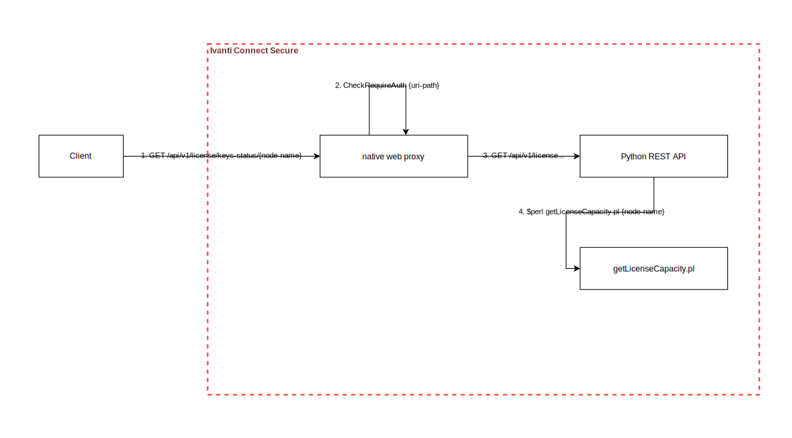

# Ivanti Connect Secure example #
## Background ##
This sample shows a modeled representation of the [two vulnerabilities in Ivanti Connect Secure and Ivanti Secure Policy Gateways](https://forums.ivanti.com/s/article/CVE-2023-46805-Authentication-Bypass-CVE-2024-21887-Command-Injection-for-Ivanti-Connect-Secure-and-Ivanti-Policy-Secure-Gateways?language=en_US).
The sample has been put together based on the technical analysis article published [here](https://attackerkb.com/topics/AdUh6by52K/cve-2023-46805/rapid7-analysis).

## Disclaimer ##
Note that the intention with this example is to illustrate a sample threat model for educational purposes. We don't claim that this reflects the actual implementation. We don't know if the development team did threat modeling or not, nor what threat modeling methodology they used.

# Threat model #
## What are we working on? ##
Imagine that we are the development team working on the product affected.

We are about to deliver a new API for checking license key status.
This will form the first use case in our threat model.



The data flow consists of four main steps:
1. The API call from any client (user agent)
1. The check to see if this API call requires authentication or allows anonymous calls
1. The forwarding of the API call to the Python REST API app
1. The call to the PERL script to get the license info

The visualization of the use case context is extremely valuable in the next step of threat modeling - *What can go wrong?*

## What can go wrong? ##
Let's see how a development team can continue with asking themselves _What can go wrong?_ What input can be affected from outside the trust boundary? There are at least two obvious items, based on the visualization provided:
1. The _URI path_
1. The _node-name_ parameter

Are these parameters used in subsequent calls within the same data flow? Yes, both of them are.

### The URI path ###
The _URI path_ is used to determine if the API call requires authentication or not. The check is made on all incoming API calls, using the CheckRequireAuth function. That function was already implemented, and the new API for license key checking should only be available for authenticated admins.

We need to ask ourselves, _how does this function determine if authentication is required or not?_ Anonymous calls are allowed if the URI path *begins with* any of the following:
* "/api/v1/ueba/"
* "/api/v1/integration/"
* "/api/v1/dsintegration"
* "/api/v1/pps/action/"
* "/api/my-session"
* "/api/v1/totp/user-backup-code"
* "/api/v1/esapdata"
* "/api/v1/sessions"
* "/api/v1/tasks"
* "/api/v1/gateways"
* "/_/api/aaa"
* "/api/v1/oidc"

Since the new API should require authentication, we shouldn't modify the list above.

Can any attacker try to manipulate this check? Maybe. What if an attacker crafts a URI path that begins with any of the above, but leads to some other API being called in the Python Rest API? We must assume that the attacker knows how the check is implemented (and how it potentially could be circumvented).

This forms our first threat:
_An attacker supplies a specially crafted URI to bypass the authentication check_

Example of how such a URI could look:
```
/api/v1/totp/user-backup-code/../../license/keys-status
```

### The node-name parameter ###
The node-name is forwarded through the web proxy, to the Python REST API, and as a shell command parameter to the perl script. If the format of the parameter value isn't validated, an attacker can inject whatever they want to the shell command.

This gives our second threat:
_An attacker supplies a specially crafted node-name parameter, to execute arbitrary shell commands on the target OS_

Example of how such a node-name parameter value could look (before URL encoding it):
```
;reboot;
```

## What are we going to do about it? ##
Let's look at each identified threat separately.

### An attacker supplies a specially crafted URI to bypass the authentication check ###
Is this threat only relevant for the new API call added? Not really, but it probably doesn't matter at the moment. We've concluded that it's possible to circumvent the auth check, and we need a fix for it (a countermeasure). A countermeasure can be to improve the CheckRequireAuth logic, and perform thorough validation of the URI path there. This is not as easy as it seems, especially if it should be forward-compatible with minor API changes under existing API paths. Suggesting countermeasures are beyond the scope of this article. The development team knows what's feasible and suitable for the product.

### An attacker supplies a specially crafted node-name parameter, to execute arbitrary shell commands on the target OS ###
There are three main things to consider as countermeasure for this threat. We prefer a combination, rather than selecting one of them:
1. Avoid spawning shell commands based on untrusted inputs (validated or not). Revise the implementation so that it doesn't create a shell.
1. Add input validation as an additional sanity check, to only accept valid characters of a node-name.
1. Consider running the logic as a non-privileged/sandboxed process

>[!NOTE]
>We've identified two security threats, and improvements to be made. As developers, we must ensure that we bring this to our backlog as implementation tickets. We must also ensure that relevant stakeholders are aware of the issues, to get them prioritized.

## Did we do a good enough job? ##
We believe we did a good job if the two identified threats are mitigated when we deliver the new API. Since the first threat applies even for existing API calls, we should consider to deliver that separately.
Longer-term, we should consider simplifying the overall implementation. Having multiple components in the chain making security checks introduces complexity, and such complexity can sometimes be exploited. As an example, it might be possible to migrate the perl logic to python. That would enable us to call that logic as a python module, rather than executing a separate process.
